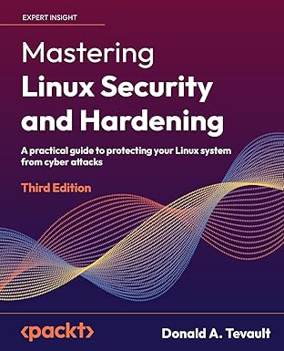

# Post Quantum Safe Algorithms in the Red Hat Enterprise Linux 10.1 Distros

by Donald A. Tevault

All right, folks.  I have great news for anyone who uses either Red Hat Enterprise Linux (RHEL) or one of the free-of-charge RHEL clones such as Rocky Linux and AlmaLinux.  It's that Post Quantum Safe (PQS) encryption algorithms are now enabled by default in the newly-released 10.1 versions.  When the RHEL 10.0 distros were released in the middle of 2025, the PQS algorithms were there, but they were marked as "experimental".  So, you had to jump through some hoops to enable them.  Now though, in version 10.1, PQS is enabled by default and is ready for production.  In the following demos, I'll prove to you that PQS key exchange is enabled in OpenSSH, and that you can create a PQS-ready security key with OpenSSL.

## Testing OpenSSH

For the first test, I'll boot up my Kali Linux virtual machine, and use the `ssh-audit` programs to scan my AlmaLinux 10.1 virtual machine.  Here are the results:

```bash
┌──(kali㉿kali)-[~]
└─$ ssh-audit 192.168.56.118    

# general

(gen) banner: SSH-2.0-OpenSSH_9.9
(gen) software: OpenSSH 9.9
(gen) compatibility: OpenSSH 9.9+, Dropbear SSH 2020.79+
(gen) compression: enabled (zlib@openssh.com)

# key exchange algorithms

(kex) mlkem768x25519-sha256                 -- [info] available since OpenSSH 9.9
                                            `- [info] hybrid key exchange based on post-quantum resistant algorithm and proven conventional X25519 algorithm
(kex) curve25519-sha256                     -- [info] available since OpenSSH 7.4, Dropbear SSH 2018.76
                                            `- [info] default key exchange from OpenSSH 7.4 to 8.9
(kex) curve25519-sha256@libssh.org          -- [info] available since OpenSSH 6.4, Dropbear SSH 2013.62
                                            `- [info] default key exchange from OpenSSH 6.5 to 7.3

. . .

. . .
```

I can't show you the entire output, but I can show you what you need to see.  First, you see that AlmaLinux 10.1 is running OpenSSH version 9.9.  It's not the newest version of OpenSSH, but it's new enough to have the newest PQS algorithms.  Under the `# key exchange algorithms` line, you see that the first key exchange (`kex`) algorithm listed is the `mlkem768x25519-sha256` algorithm.  This is a hybrid algorithm that combines the PQS `mlkem768` algorithm that's approved by the U.S. National Institute of Standards and Technology with the non-PQS `curve 25519` algorithm.  Using this hybrid approach doesn't allow non-PQS clients to log into this machine.  It's just that some people still don't have complete confidence in the security of PQS algorithms. So, they created hybrid algorithms that expect a key exchange to be successful for both the PQS and non-PQS components.  In this case, if a key exchange successfully completes for the `mlkem768` algorithm but doesn't successfully complete for the `curve25519` algorithm, then the key exchange fails.  

The next two lines show that the `curve25519` non-PQS algorithm is enabled, which is what allows non-PQS clients to log in.  If all of the clients on your network that will log into this server are running PQS algorithms, then you'll want to disable `curve25519`.  (Showing you how to do that is beyond the scope of this article.)

Something that I can't show you here is that `ssh-audit` displays its output with a color-code system.  Algorithms that display in green type are considered as okay, and algorithms that display in red type are consider as broken, and should be disabled.  What I find very curious is that every Linux or BSD distro that I've ever tested has a lot of broken algorithms still enabled.  This even includes the newest RHEL 10.1 distros.  For example, here's one of the algorithms that show up in red on my AlmaLinux 10.1 machine:

```bash
<span style="color:red">
(kex) ecdh-sha2-nistp256                    -- [fail] using elliptic curves that are suspected as being backdoored by the U.S. National Security Agency
</span>                                            `- [info] available since OpenSSH 5.7, Dropbear SSH 2013.62
```

Yikes!  You see what that says?  It says that there's a suspected back door in this algorithm that could grant access to the U.S. National Security Agency.  There are several more algorithms like this, and you definitely want to disable all of them.  (Again, showing you how is beyond the scope of this article.)

The second way to test the OpenSSH setup is to just log in to the machine from a client that's using OpenSSH 10.2 or better.  For example, here's how it looks when I log into an older AlmaLinux 9.7 server from my OpenMandriva ROME workstation:

```bash
[donnie@openmandriva-x8664 ~]$ ssh -V  
OpenSSH_10.2p1, OpenSSL 3.6.0 1 Oct 2025  
[donnie@openmandriva-x8664 ~]$ ssh donnie@192.168.0.20  
Warning: Permanently added '192.168.0.20' (ED25519) to the list of known hosts.  
** WARNING: connection is not using a post-quantum key exchange algorithm.  
** This session may be vulnerable to "store now, decrypt later" attacks.  
** The server may need to be upgraded. See https://openssh.com/pq.html  
donnie@192.168.0.20's password:    
Activate the web console with: systemctl enable --now cockpit.socket  

Last login: Thu Dec  4 11:09:08 2025  
[donnie@almalinux9 ~]$
```

It allowed me to log in, but it gave me a warining message about how I'm logging into a server that isn't using PQS algorithms.  (This warning message is a new feature of the newest versions of OpenSSH.)

Now, here's how it looks when I log into my AlmaLinux 10.1 server:

```bash
donnie@192.168.56.118's password:    
Web console: https://localhost:9090/  

Last login: Thu Dec  4 11:04:30 2025  
donnie@localhost:~$
```

This time I don't get that warning message, which proves that the server is using a PQS algorithm.

Now, let's take a quick look at OpenSSL.

## Creating a PQS key with OpenSSL

The RHEL 10.1 distros come with OpenSSL 3.5, as you see here:

```
donnie@localhost:~$ openssl version  
OpenSSL 3.5.1 1 Jul 2025 (Library: OpenSSL 3.5.1 1 Jul 2025)  
donnie@localhost:~$
```

As of December 2025, the newest version of OpenSSL is version 3.6.  But, version 3.5 has been designated as the Long Term Support version, and it's new enough to have the required PQS algorithms.  Here's how to create a PQS key on AlmaLinux 10.1:

```
donnie@localhost:~$ openssl genpkey -des3 -algorithm mldsa87 -out root-ca.key
```

Here, we're using the `mldsa87` PQS algorithm to create a key for a root-level certificate authority server.  The process for using these new keys with security certificates is pretty much the same as what you've been used to.

## Understanding CNSA 2.0

So, why is this important?  It's just that the newest 2.0 version of the Commercial National Security Algorithm (CNSA 2.0) requirements from the U.S. National Security Agency (NSA) and National Institute for Standards and Technology (NIST) dictate that beginning in 2026, everybody must begin transitioning to PQS algorithms.  It will be a long process, and the transition must be complete by the end of 2031.

## Simplified Configuration

Unlike the RHEL 10.0 distros, the RHEL 10.1 distros don't require you to reconfigure the system to enable the PQS algorithms.  In the 10.1 distros, the PQS algorithms are already enabled by default.  However, you'll still want to do some reconfiguration to disable the weak and broken algorithms that are still enabled.



[Buy my Mastering Linux Security and Hardening book now, via my Amazon link!](https://amzn.to/3MiKsZ9)

## Summary

In this article, we looked at the PQS algorithms for OpenSSH and OpenSSL in the Red Hat 10.1 series of Linux distros.  We also looked at the CNSA 2.0 standards from the U.S. government, that require everybody to start the transition to PQS algorithms beginning in 2026.

I hope that you enjoyed this article, and that you'll look for more to come.

Ciao,

Donnie
